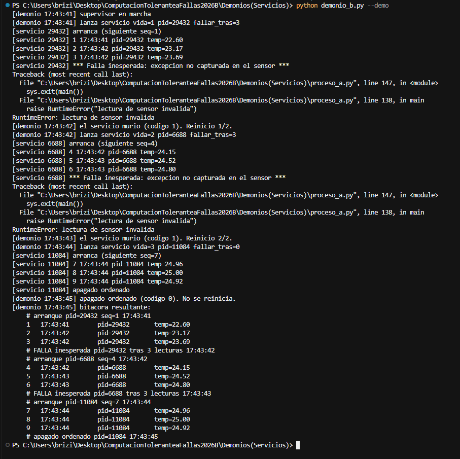

# Práctica: Demonios (servicios)

Implementé un **servicio en segundo plano** y un **demonio supervisor**. El servicio anota la temperatura de un cuarto de servidores. Si ese proceso muere, el demonio lo vuelve a levantar solo.

---

## Propuesta del escenario

### El problema

El cuarto de servidores hay que vigilarlo todo el tiempo. Un proceso lee un sensor (aquí simulado) y agrega cada lectura a `datos/bitacora.log`: número de secuencia, hora, pid y temperatura. Si nadie escribe esa bitácora, un sobrecalentamiento pasa desapercibido.

### Por qué requiere ejecución en segundo plano

No es un programa que el usuario abre, usa y cierra. Tiene que seguir leyendo el sensor aunque no haya nadie frente a la terminal: de noche, entre clases, o mientras otra parte de la aplicación hace otra cosa. Por eso el trabajo vive en un proceso aparte (el servicio) y otro proceso (el demonio) se queda vigilándolo.

### Qué tipo de falla puede ocurrir

La falla que cubre este diseño es la **muerte inesperada del proceso**, no un error que el mismo proceso alcanza a reintentar. Puede ser una excepción que nadie capturó, un `kill`, o el corte que simula `--fallar-tras`. El proceso termina con un código distinto de 0 y deja de escribir la bitácora. Un apagado pedido (Ctrl+C o la señal `datos/detener`) sale con código 0: eso no es una falla.

### Qué estrategia de tolerancia se aplica

**Supervisión con reinicio automático** (watchdog). El demonio no lee el sensor. Solo lanza al servicio, mira el código de salida y decide:

| Código | Qué significa | Qué hace el demonio |
| --- | --- | --- |
| distinto de 0 | el servicio murió inesperadamente | lo vuelve a lanzar |
| 0 | apagado ordenado | no lo reinicia |
| muchas muertes seguidas | la falla parece permanente | se detiene al llegar a `--max-reinicios`, para no reiniciar en ciclo |

Al relanzar, el servicio nuevo lee la bitácora y **sigue la secuencia**. La falla no se borra: queda una línea `# FALLA` y cambia el pid. Lo que se recupera es la disponibilidad (alguien sigue anotando la temperatura).

---

## Cómo está armado

Hay dos procesos:

| Proceso | Archivo | Rol |
| --- | --- | --- |
| A, servicio principal | `proceso_a.py` | Bucle de lecturas. Es el que corre en segundo plano |
| B, demonio monitor | `demonio_b.py` | Lo arranca con `subprocess`, espera el código de salida y lo reinicia si hace falta |

El demonio es el padre. No adivina si el hijo sigue vivo por el archivo `servicio.pid`: ese archivo puede quedar viejo después de un crash. La prueba es el proceso que él mismo lanzó.

El servicio revisa `datos/detener` entre lecturas. Si el archivo existe, escribe `# apagado ordenado`, lo borra y sale con código 0. El demonio ve ese 0 y no lo revive.

---

## Cómo ejecutarlo

No hay dependencias: solo la biblioteca estándar. Desde esta carpeta:

```bash
python demonio_b.py --demo
```

Esa corrida limpia `datos/`, deja que el servicio muera dos veces (cada vida dura 3 lecturas), lo reinicia, y en la tercera vida pide un apagado ordenado. Tiene que verse el cambio de pid, la secuencia 1…9 sin volver a 1, y al final la frase de que el código 0 **no** se reinicia.

Dejarlo corriendo de verdad, hasta cortarlo a mano:

```bash
python demonio_b.py
```

Ctrl+C le pide al servicio un apagado ordenado. No lo relanza.

Para ver el tope (un reinicio y después el demonio se rinde):

```bash
python demonio_b.py --fallar-tras 1 --max-reinicios 1 --intervalo 0.2
```

El servicio solo, sin supervisor, también arranca. Si se cae, nadie lo levanta: esa es la diferencia.

```bash
python proceso_a.py --intervalo 0.5 --fallar-tras 4
```

---

## Qué se ve en la demo

El primer proceso (pid 29432) anota 1, 2 y 3 y revienta con `RuntimeError`. El demonio lee el código 1 y lanza otro proceso. Ese sigue en la secuencia 4, no en 1. Tras el segundo crash, el tercer proceso (pid 11084) anota 7, 8 y 9 y sale en orden. El demonio no lo reinicia. Abajo, la bitácora deja las dos fallas, el cambio de pid y el apagado ordenado.



---

## Archivos

| Archivo | Rol |
| --- | --- |
| `proceso_a.py` | Servicio principal. Escribe la bitácora y puede morir a propósito |
| `demonio_b.py` | Monitor. Reinicia al servicio si el código de salida no es 0 |
| `datos/bitacora.log` | Lecturas, arranques y fallas (se regenera con `--demo`) |
| `datos/supervisor.log` | Decisiones del demonio: lanzar, reiniciar o parar |
| `datos/detener` | Señal de apagado ordenado. El servicio la consume y sale con 0 |
| `datos/servicio.pid` | Pid de la vida actual. Si hubo crash, puede quedar desactualizado |

---

## Conclusión

El servicio no se salva solo: cuando el proceso ya murió, no hay código adentro que pueda reintentar. La tolerancia está en el otro proceso. El demonio distingue una falla (código distinto de 0) de un apagado pedido (código 0), relanza solo en el primer caso, y deja de insistir si la falla se repite más de la cuenta.
