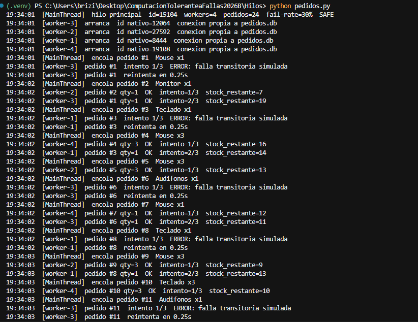
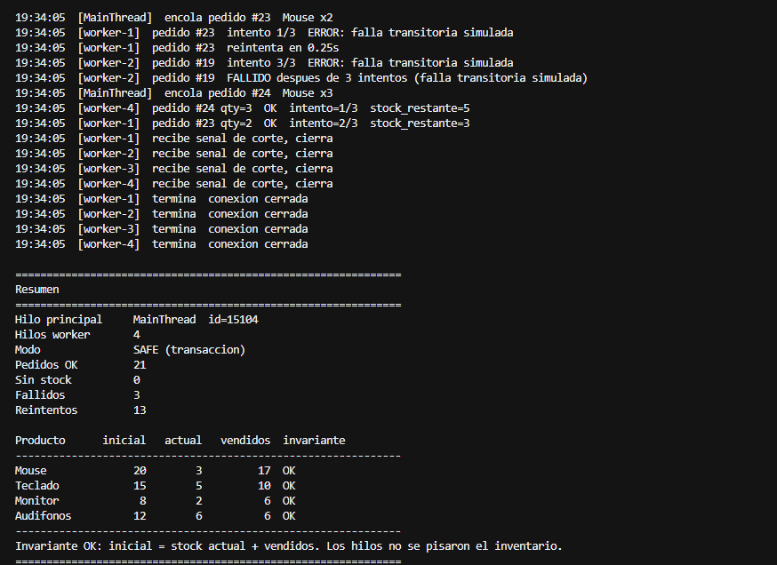

# Práctica: Hilos y base de datos (pedidos concurrentes)

Implementé un programa con **hilos en Python** que atiende pedidos de una tienda al mismo tiempo y los guarda en **SQLite**. Varios cajeros (cada uno es un hilo) toman trabajo de una cola, actualizan el inventario y registran el resultado. Si un intento falla, **reintenta** en lugar de tumbar el proceso.

Los hilos en Python sirven sobre todo cuando hay espera de I/O. Hablar con la base de datos es exactamente ese caso: el hilo se queda bloqueado en el `COMMIT` o en un lock, y los demás siguen trabajando.

---

## 1. El escenario: una tienda con varios cajeros

Hay cuatro productos (Mouse, Teclado, Monitor, Audífonos) con stock inicial fijo. El hilo principal mete pedidos en una cola; los workers los sacan, bajan inventario y marcan el pedido como `ok`, `sin_stock` o `failed`.

Cada worker abre **su propia conexión** a `pedidos.db`. SQLite no está pensado para compartir una conexión entre hilos, así que eso es parte del diseño, no un detalle.

Al arrancar se ve el hilo principal y los cuatro workers, cada uno con un id nativo distinto. En la misma corrida los logs se intercalan: `MainThread` encola y `worker-1` … `worker-4` procesan a la vez (un worker puede estar en error/reintento mientras otro ya marcó OK). Esa mezcla es la prueba de que no es un solo flujo secuencial.



---

## 2. Dónde están los hilos y cómo funcionan

Los hilos se crean en `workers.py`, función `start_workers`. Ahí está el `threading.Thread(...)` con `target=worker_loop` y el nombre `worker-1`, `worker-2`, etc. `pedidos.py` solo los pide y después hace `join`.

Hay dos tipos de hilo:

| Hilo | Dónde | Qué hace |
| --- | --- | --- |
| `MainThread` | `pedidos.py` | Crea la base, encola pedidos, manda la señal de corte y espera a que terminen |
| `worker-N` | `workers.py` → `worker_loop` | Toma un pedido de la cola, habla con SQLite, reintenta si falla |

La cola es una `queue.Queue`. Esa clase ya es thread-safe: el productor hace `put` y los workers hacen `get` sin un lock extra. Cuando no quedan pedidos, el hilo principal mete un `None` por cada worker (poison pill) para que salgan del `while True` y cierren su conexión.

El ciclo de un worker, en la práctica, es este:

1. Arranca, guarda su `threading.get_ident()` y abre una conexión a SQLite.
2. Se bloquea en `queue.get()` hasta que hay un pedido.
3. Intenta bajar el stock y marcar el pedido.
4. Si sale una falla transitoria o `database is locked`, espera un poco y reintenta (hasta `--max-attempts`).
5. Si recibe `None`, cierra la conexión y termina.

La baja de stock segura es un solo `UPDATE ... WHERE stock >= qty` dentro de `BEGIN IMMEDIATE`. O todos los hilos ven un inventario coherente, o el pedido queda en `sin_stock`. No hay un paso intermedio en el que el stock quede a medias.

---

## 3. Qué falla y cómo se recupera

Simulo fallas transitorias (`--fail-rate`, por defecto 30%): el worker lanza un error a propósito, escribe el intento en el log y vuelve a probar el mismo pedido. Eso es el equivalente a un lock de SQLite, un timeout o un corte corto de red. El hilo no muere; el pedido tampoco se pierde a la primera. En la captura de arriba se ve, por ejemplo, el `worker-3` fallando el pedido #1 y reintentando 0.25 s después, mientras los demás siguen.

Al terminar, el resumen cuenta OK / sin stock / fallidos / reintentos y comprueba el invariante:

**stock inicial = stock actual + piezas vendidas (`status = ok`)**

Con transacciones ese invariante se cumple. El programa acaba aunque algunos pedidos hayan fallado después de tres intentos (en esta corrida, 21 OK, 3 fallidos, 13 reintentos; el inventario sigue cuadrando).



El contraste es `--unsafe`: el worker **lee** el stock, espera un momento y **escribe** el número que calculó. Dos hilos pueden leer 10, ambos restar 2 y los dos guardar 8. Debería quedar 6. El invariante se rompe: hay ventas `ok` que no se reflejan en el stock.

Eso es una condición de carrera clásica. En tolerancia a fallas importa porque el proceso “terminó bien” y la base quedó inconsistente. La reparación no es más hilos, es la transacción (y el reintento si SQLite está ocupada).

---

## 4. Cómo ejecutarlo

No hay dependencias: usa `threading`, `queue` y `sqlite3` de la librería estándar. Desde esta carpeta:

```bash
python pedidos.py
```

Eso levanta **4 hilos worker** y **24 pedidos**, con fallas transitorias al 30% y hasta 3 intentos. Sirve para capturar el arranque, el intercalado de logs y el resumen.

Demo de la condición de carrera (sin fallas simuladas; los hilos se pisan el stock):

```bash
python pedidos.py --unsafe --workers 4 --orders 30 --delay 0.2
```

Menos hilos, para comparar la consola:

```bash
python pedidos.py --workers 2 --orders 12 --fail-rate 0
```

Otras banderas: `--fail-rate 0.3`, `--max-attempts 3`, `--delay 0.15`, `--seed 42`.

Cada corrida borra `pedidos.db` y la crea de nuevo, para que el stock inicial sea siempre el mismo.

---

## 5. Archivos

| Archivo | Rol |
| --- | --- |
| `pedidos.py` | Hilo principal: argumentos, cola, arranque de workers y resumen |
| `workers.py` | `threading.Thread`, `worker_loop`, reintentos |
| `db.py` | Esquema SQLite, conexión por hilo, transacción vs. lectura-escritura insegura |
| `pedidos.db` | Base de la corrida (se regenera cada vez) |

---

## Conclusión

Los hilos no evitan que un pedido falle; evitan que **un cajero ocupado detenga a los demás**. La tolerancia a fallas está en tres sitios: una conexión por hilo, una transacción al tocar el stock y reintentos cuando el error es transitorio. Sin eso, el programa igual “usa hilos”, pero el inventario deja de ser verdad.
