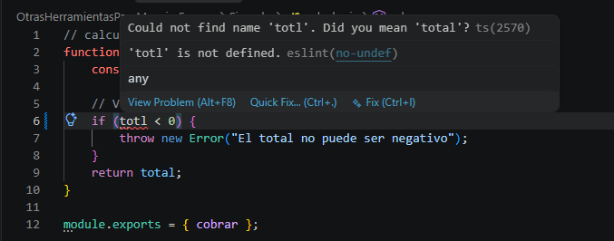
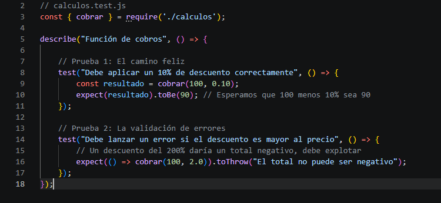
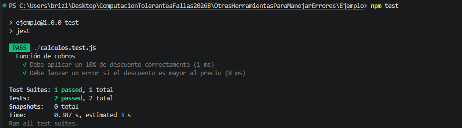
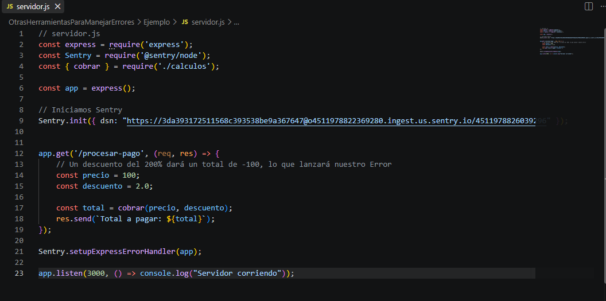
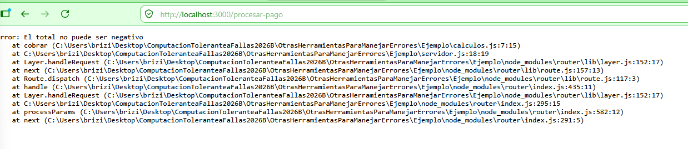
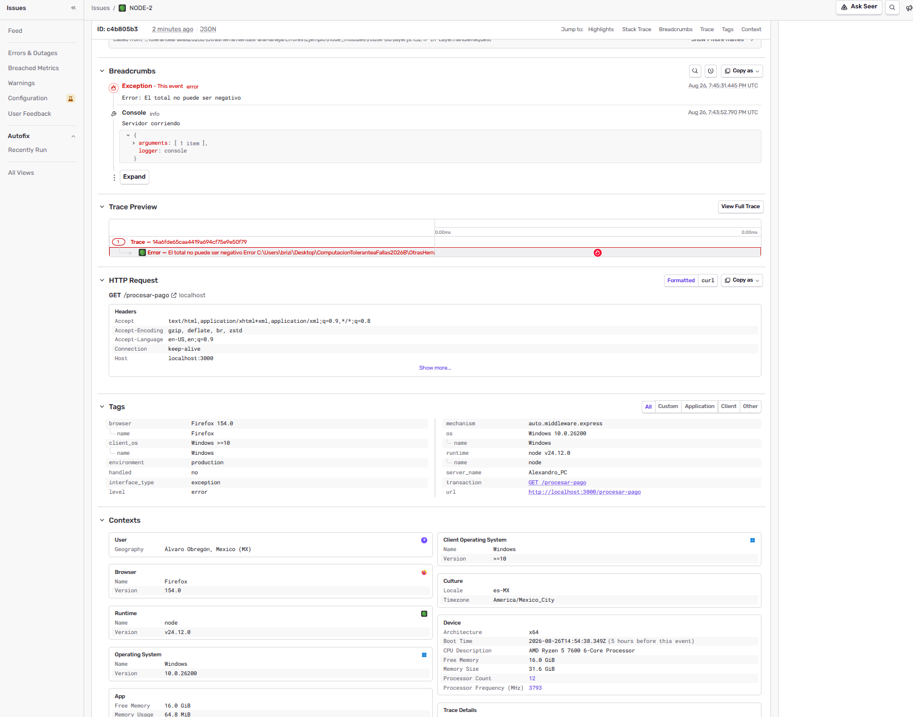

# Práctica: Herramientas para el Manejo de Errores en Node.js 🛠️

Probe tres herramientas útiles para el manejo de errores en el código: **ESLint** (para prevenirlos al escribir), **Jest** (para probar que la lógica funcione) y **Sentry** (para atrapar los fallos cuando el proyecto ya está corriendo).

---

## 1. ESLint: Previniendo errores de dedo (Prevención)

Para probar el linter, escribí a propósito mal una variable dentro de mi función matemática (`totl` en lugar de `total`). 

Gracias a ESLint, no tuve que esperar a ejecutar el programa o abrir el navegador para darme cuenta. La herramienta analizó mi código y me marcó la variable indefinida inmediatamente en el editor, obligándome a corregir el error tipográfico antes de guardar.

 

---

## 2. Jest: Pruebas automatizadas (Validación)

Creé un archivo `calculos.test.js` para asegurar que mi función procesara los descuentos correctamente y, más importante aún, que fallara cuando debía hacerlo. Hice dos escenarios:
1. **El camino feliz:** Que un descuento normal del 10% se aplique bien.
2. **Forzando un error:** Que si envío un descuento ilógico (como 200%), la función detecte el número negativo y lance una excepción ("El total no puede ser negativo").

 

Al ejecutar `npm test`, Jest corrió ambos escenarios de forma automática y confirmó que las reglas de mi código estaban bien establecidas, pasando ambas pruebas exitosamente.

---

## 3. Sentry: Atrapando errores en Producción (Monitoreo)

Finalmente, quería ver qué pasa cuando el código ya está montado en un servidor web y un usuario rompe la aplicación. 

Conecté Sentry a mi servidor con Express y configuré la ruta de pagos para que siempre intentara aplicar el descuento inválido del 200%. 

Para forzar el fallo "en vivo", abrí mi navegador y visité la ruta `http://localhost:3000/procesar-pago`.

Como era de esperarse, la página detuvo su ejecución por el error matemático:

Pero lo interesante pasó despues. Inmediatamente **Sentry** atrapó la excepción, me envió un correo de alerta y registró el incidente en su panel web. Ahí pude ver exactamente que falló, qué navegador lo provocó y todo el contexto necesario para solucionarlo.

---

### Conclusión
Con este flujo, comprobé cómo estas herramientas actúan como una red de seguridad en diferentes etapas del desarrollo: ESLint te salva mientras escribes, Jest te da confianza antes de subir el código, y Sentry vigila por ti cuando el usuario ya lo está usando.