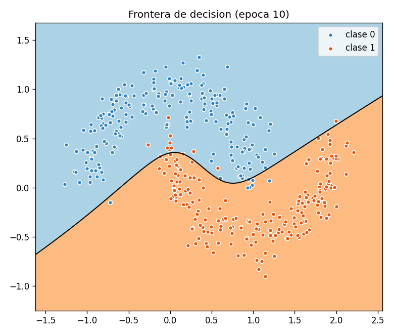
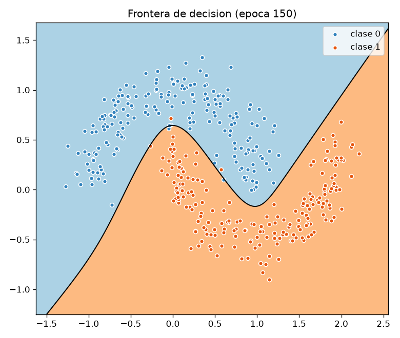
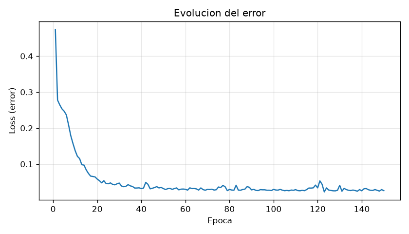
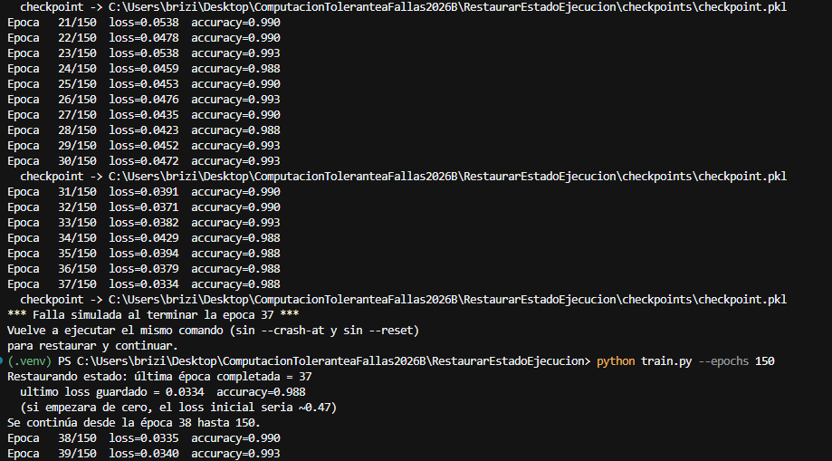
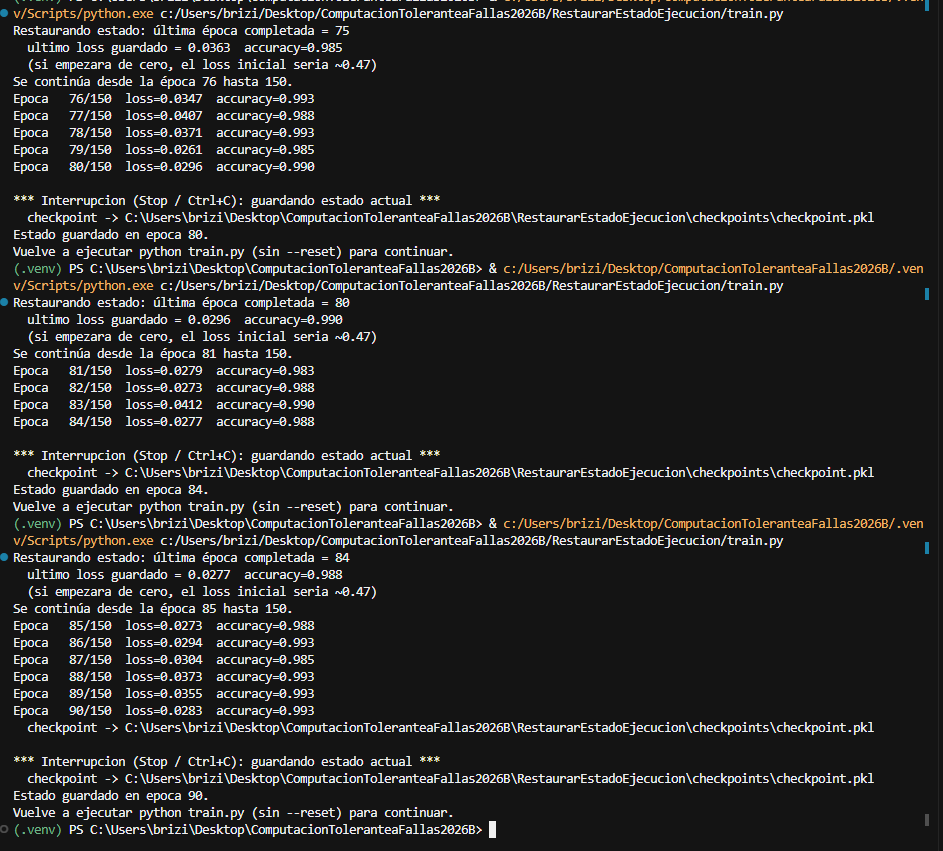
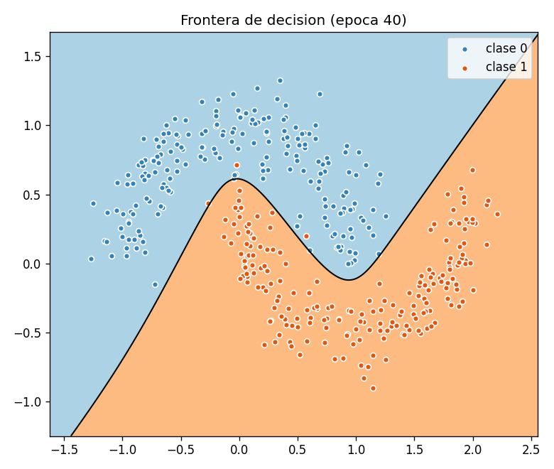
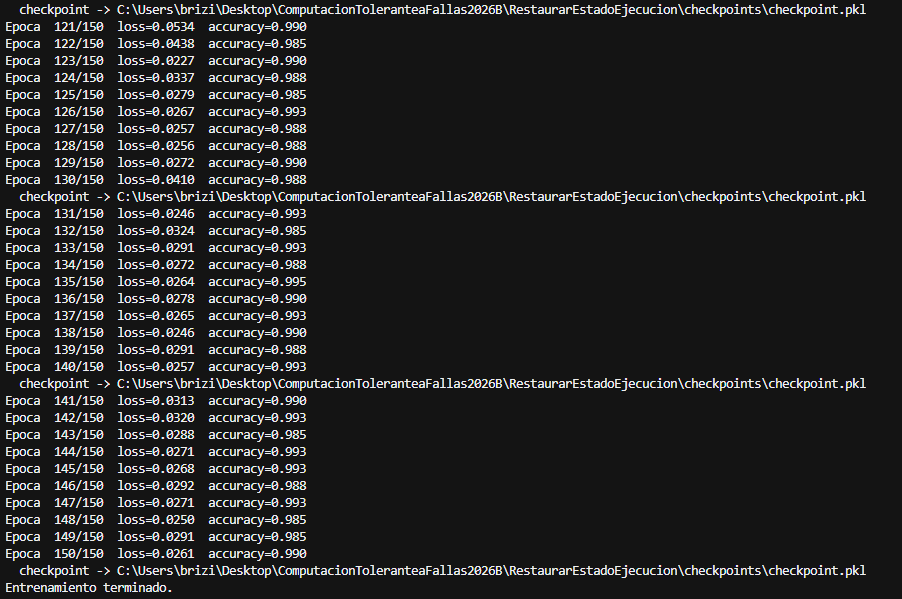
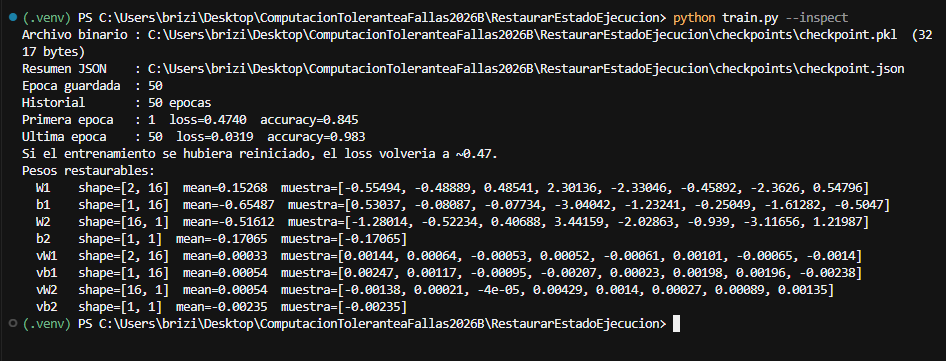

# Práctica: Restaurar el estado de ejecución (Application Checkpointing)

Implementé **checkpointing a nivel de aplicación**: un programa que hace un trabajo largo (entrenar un clasificador 2D), guarda periódicamente su estado en disco y, si se cae, **reanuda desde el último checkpoint** en lugar de empezar de cero.

El checkpointing es una técnica de tolerancia a fallas. La idea es no perder el progreso cuando hay una falla transitoria (se cierra la terminal, se acaba la batería, se mata el proceso).

---

## 1. El trabajo largo: un clasificador 2D

Necesitaba un proceso que durara varias iteraciones, para que guardar y restaurar el estado tuviera sentido. Usé un clasificador sencillo: puntos en un plano con forma de dos lunas.

- Cada punto tiene coordenadas $(x, y)$.
- La etiqueta **0** o **1** la pone el dataset (luna A vs luna B); el modelo no se la inventa.
- Una red pequeña (2 entradas → 16 neuronas → 1 salida) aprende a predecir la clase.
- Si la salida es $\geq 0.5$ predice **1**; si no, **0**.

Cada pasada completa por los datos es una **época**. Al inicio los pesos son aleatorios y el error (loss) es alto. Conforme entrena, el error baja y la curva que separa las dos clases (la **frontera de decisión**) se ve más razonable.

A la época 10 todavía se equivoca en la zona donde las lunas se cruzan:



Al terminar el entrenamiento (150 épocas, accuracy ≈ 0.99) la frontera ya sigue la forma de las lunas:



La curva de error muestra por qué importa no perder el progreso: las primeras épocas bajan el loss de ~0.47 a ~0.05; después el modelo solo afina. Si fallara a la mitad y no hubiera checkpoint, habría que repetir todo ese trabajo.



---

## 2. Qué se guarda (el estado de ejecución)

No basta con “guardar el modelo”. El estado que serializo en `checkpoints/checkpoint.pkl` es:

| Campo | Para qué |
| --- | --- |
| `epoch` | Hasta qué época se había completado |
| `model` | Pesos, bias y velocidades del momentum |
| `rng` | Estado del generador aleatorio (orden de los mini-lotes) |
| `history` | Historial de loss y accuracy, para que la gráfica no se corte |
| `args` | Hiperparámetros con los que se entrenó |

La escritura es **atómica**: se escribe un `.tmp`, el checkpoint anterior pasa a `.prev` y luego se reemplaza el archivo principal. Así un corte a mitad de escritura no deja un pickle a medias como único backup.

El ciclo, en la práctica, es este:

1. Se entrena una época y se actualizan pesos, loss e historial.
2. Si la época es múltiplo de 10 (o es la última), ese estado se escribe a disco.
3. Si no toca guardar, se sigue con la siguiente época.
4. Si el proceso se cae, al volver a lanzar `train.py` se lee `checkpoint.pkl`.
5. Se restauran época, pesos e historial, y el bucle arranca en **N+1**, no en 1.

---

## 3. Experimento: fallar y restaurar

Los dos mensajes **no salen en el mismo comando**. El primero es la falla; el segundo aparece al **volver a ejecutar** (sin `--reset`).

```bash
python train.py --reset --epochs 150 --checkpoint-every 10 --crash-at 37
python train.py --epochs 150
```

En la captura, el proceso se detiene en la época 37 (`*** Falla simulada... ***`). Al relanzar, no vuelve a la época 1: restaura la 37 y sigue en la 38, con el mismo loss (~0.033), no el ~0.47 de un entrenamiento nuevo.



También lo probé a mano, con **Stop / Ctrl+C**. Cada vez guarda la última época completada. Al ejecutar otra vez `python train.py` (sin `--reset`) continúa: 75 → 76, luego 80 → 81, luego 84 → 85. El loss se queda cerca de 0.03.



La frontera en disco es el estado que quedó serializado en ese momento:



El entrenamiento sí llega al final. Cada 10 épocas (y también al terminar) se vuelve a escribir el checkpoint:



### Qué hay dentro del checkpoint

`checkpoint.pkl` es binario (pickle); no se lee a ojo. Al guardar también se escribe `checkpoints/checkpoint.json`. Para verlo en consola:

```bash
python train.py --inspect
```

Ahí se ve la época guardada, que el historial no está vacío, que el loss bajó (de 0.47 en la época 1 a ~0.03 en la última) y una muestra de los pesos `W1`, `b1`, `W2`, `b2` más el momentum (`vW1`, etc.). Eso es el estado de ejecución que se restaura.



Copia del JSON: [Imagenes/checkpoint.json](Imagenes/checkpoint.json).

---

## 4. Cómo ejecutarlo

Desde esta carpeta:

```bash
pip install -r requirements.txt
python train.py
```

Al terminar se generan `artifacts/loss.png`, `artifacts/boundary.png` y `checkpoints/checkpoint.pkl`.

Demo de falla y restauración (dos comandos; el segundo **sin** `--reset`):

```bash
python train.py --reset --epochs 150 --checkpoint-every 10 --crash-at 40
python train.py --epochs 150 --checkpoint-every 10
```

Ver el checkpoint: `python train.py --inspect`  
Borrar y empezar de cero: `python train.py --reset`  
Sin pausa entre épocas: `python train.py --epoch-delay 0`

---

## 5. Archivos

| Archivo | Rol |
| --- | --- |
| `data.py` | Genera las dos lunas y las etiquetas 0/1 |
| `model.py` | Red 2-16-1, loss, accuracy, forward/backward |
| `checkpoint.py` | Guardar / cargar / borrar de forma atómica |
| `train.py` | Bucle de entrenamiento, resume y falla simulada |

---

## Conclusión

El checkpointing no evita que el proceso se caiga; evita **perder el trabajo ya hecho**. Sin checkpoint, una falla en la época 40 obliga a repetir esas 40 épocas. Con checkpoint, recuperar el sistema es relanzar el programa: se restaura el estado de aplicación y se continúa.

El intervalo (aquí, cada 10 épocas) es el trade-off clásico: más frecuente = menos trabajo perdido y más I/O; menos frecuente = lo contrario. La escritura atómica cubre el caso en el que la falla ocurre *mientras* se está guardando.
