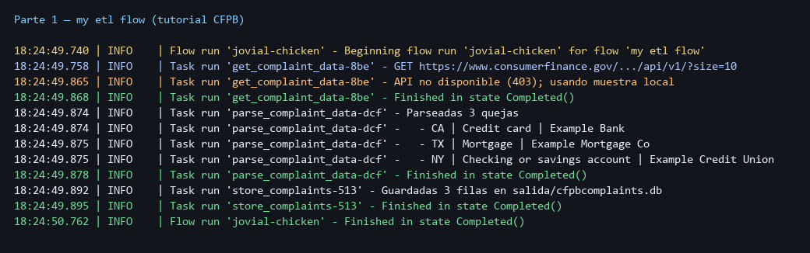
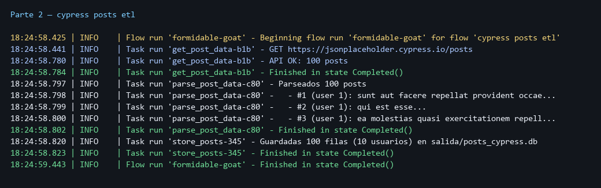
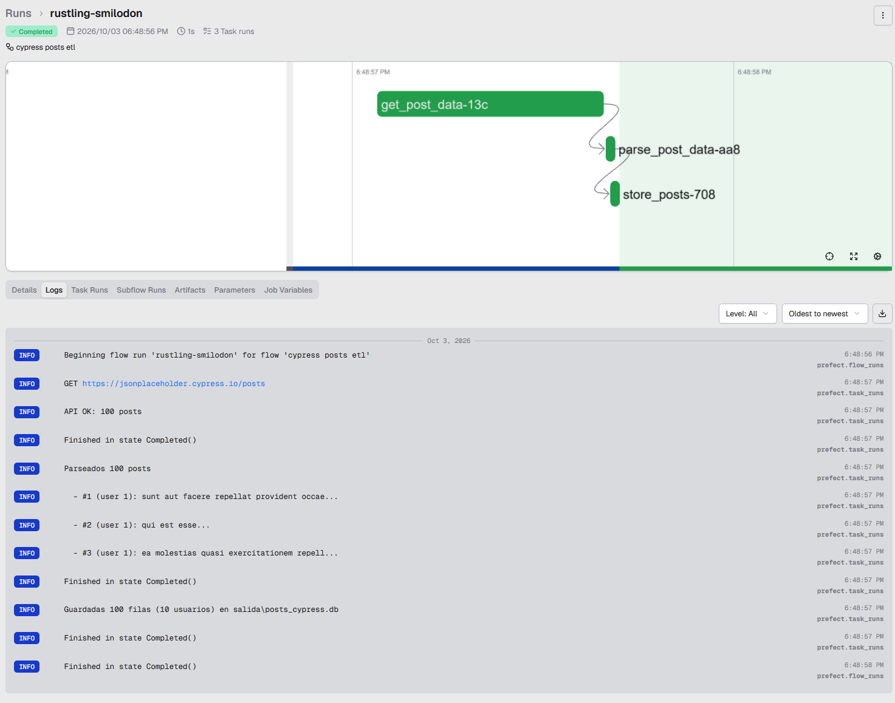

# Práctica: Workflow managers (Prefect)

Implementé el **ETL del tutorial** *Getting Started with Prefect (PyData Denver)* y lo corrí en Prefect 3. La Parte 2 es el mismo patrón (extract → transform → load), modificado para usar [jsonplaceholder.cypress.io](https://jsonplaceholder.cypress.io/) en lugar de la API del CFPB.

---

## ¿Qué es Prefect?

**Prefect** es un *workflow manager*: orquesta pasos de un pipeline en Python puro. Cada unidad de trabajo es una **task** (`@task`); el programa que las encadena es un **flow** (`@flow`). Prefect registra estado, logs, reintentos y el grafo de ejecución. El fundador es Jeremiah Lowin (*Task Failed Successfully*).

El video del tutorial usa Prefect 1 (`with Flow(...) as f` y `f.run()`). Aquí está portado a **Prefect 3** (`@flow` y llamar al flow como función), que es lo que instala `pip install prefect` hoy. La lógica del ETL es la misma.

| Concepto | Decorador | Rol en el ETL |
| --- | --- | --- |
| Task | `@task` | extract, transform o load |
| Flow | `@flow` | Orquesta las tres tasks en orden |

Videos de referencia:

- [Task Failed Successfully — Jeremiah Lowin](https://youtu.be/TlawR_gi8-Y?list=PLMGWGsnelbxcHmA5cVRq8a39S9s_gxAMq)
- [Getting Started with Prefect (PyData Denver)](https://www.youtube.com/watch?v=FETN0iivZps&t=2545s)

---

## Propuesta del escenario

### El problema

Hay que bajar datos de una API, limpiarlos y guardarlos en SQLite. Son tres pasos distintos; si falla la red a mitad, conviene saber qué task falló y poder reintentarla.

### Por qué un workflow manager

Prefect marca cada paso (Completed / Failed), puede reintentar solo el extract, y deja logs del run completo. No es un script monolítico.

### Qué tipo de falla puede ocurrir

Falla de **I/O de red** (timeout, 403, 5xx). En esta máquina la API del CFPB responde **Access Denied**; el extract lo detecta y usa una muestra local con la misma forma JSON para que el resto del ETL (parse + SQLite) se pueda demostrar igual.

### Qué estrategia de tolerancia se aplica

**Reintentos en el extract** (`retries` en `get_complaint_data` / `get_post_data`). Transform y load no reintentan: si fallan, el error es de lógica o de disco.

---

## Cómo está armado

| Archivo | Rol |
| --- | --- |
| `parte1_tutorial.py` | ETL del tutorial: CFPB → namedtuple → `salida/cfpbcomplaints.db` |
| `parte2_ejemplo.py` | Mismo ETL con Cypress: `/posts` → namedtuple → `salida/posts_cypress.db` |
| `requirements.txt` | `prefect`, `requests` |
| `salida/` | Bases SQLite generadas al correr (gitignorada) |

Correspondencia con el código del video:

| Tutorial (Prefect 1) | Aquí (Prefect 3) |
| --- | --- |
| `from prefect import task, Flow` | `from prefect import task, flow` |
| `with Flow("my etl flow") as f:` … `f.run()` | `@flow(name="my etl flow")` + `my_etl_flow()` |
| `get_complaint_data` / `parse_complaint_data` / `store_complaints` | Iguales en la Parte 1 |
| `requests` + `namedtuple` + `sqlite3` | Igual |

---

## Cómo ejecutarlo

Desde esta carpeta (o con el venv del repo ya activado):

```bash
pip install -r requirements.txt
python parte1_tutorial.py
python parte2_ejemplo.py
```

Prefect 3 levanta un servidor temporal solo para el run. No hace falta abrir esa URL. Si quieres la UI:

```bash
prefect server start
```

Abre `http://127.0.0.1:4200` y vuelve a correr los scripts.

---

## Parte 1 — Tutorial (CFPB)

Flow `my etl flow`:

1. **extract** `get_complaint_data` — `GET` a la API del CFPB (`size=10`)  
2. **transform** `parse_complaint_data` — arma `Complaint` (namedtuple)  
3. **load** `store_complaints` — inserta en SQLite  

Si la API bloquea, el log dice `API no disponible ...; usando muestra local` y el flow sigue hasta `Completed()`.



---

## Parte 2 — Ejemplo con Cypress

Misma estructura ETL, fuente nueva:

1. **extract** `get_post_data` — `GET https://jsonplaceholder.cypress.io/posts`  
2. **transform** `parse_post_data` — arma `Post` (user_id, post_id, title, body)  
3. **load** `store_posts` — inserta en `salida/posts_cypress.db`  

En la demo entran 100 posts de 10 usuarios.



En la UI de Prefect (`prefect server start` → `http://127.0.0.1:4200`) se ve el mismo run: timeline extract → transform → load en verde y los logs (GET a Cypress, 100 posts, SQLite).



---

## Archivos

| Archivo | Rol |
| --- | --- |
| `parte1_tutorial.py` | ETL del tutorial (CFPB / muestra) |
| `parte2_ejemplo.py` | ETL modificado (Cypress posts → SQLite) |
| `requirements.txt` | Dependencias |
| `Imagenes/consola_parte1.png` | Captura del run Parte 1 |
| `Imagenes/consola_parte2.png` | Captura del run Parte 2 (consola) |
| `Imagenes/ui_parte2.png` | Captura del run Parte 2 (UI Prefect) |
| `salida/cfpbcomplaints.db` | Resultado Parte 1 |
| `salida/posts_cypress.db` | Resultado Parte 2 |

---

## Conclusión

El tutorial enseña un ETL en tres tasks. Prefect 3 cambia la sintaxis del flow, no la idea. La Parte 1 reproduce ese pipeline; la Parte 2 lo reutiliza con [jsonplaceholder.cypress.io](https://jsonplaceholder.cypress.io/). La tolerancia está en los reintentos del extract y en no tumbar todo el pipeline si un paso de red falla (o, en el caso del CFPB bloqueado, degradar a una muestra con la misma forma).
